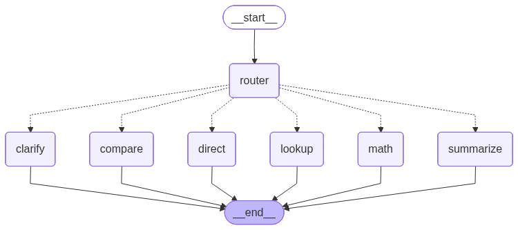

# wiki-rag-flow

For WSL users, please be aware of this error:
The command 'docker-compose' could not be found in this WSL 2 distro.
Go to Docker Desktop -> Settings -> Resources -> WSL Integration -> check "Enable integration with my default WSL distro" and switch your local Linux distro.

## Set up the application environment
1. Download and install Ollama from [https://ollama.com/download](https://ollama.com/download) for your platform.
For WSL, you must download it directly. You can do this using the following command:
```bash
curl -fsSL https://ollama.com/install.sh | sh
```
2. Commands to quickly download Ollama models:
```bash
make ollama-pull-llama

make ollama-pull-gemma

make ollama-pull-qwen
```
3. Install the libraries required for the local parser:
```bash
make parser-packages
```
4. Run the environment containers:
```bash
make project-up
```

## Scraper

To build and run the Wikipedia scraper container, execute these two commands:
```bash
make build-scraper
make run-scraper
```

## Parser
The Wikipedia parser is run natively for better data processing performance and improved communication with the native embedding server. To run it (make sure to do this after running the scraper), execute the following command in your terminal:
```bash
python3 -m parser.wiki
```

## Application
Once the data is loaded into the Weaviate database and the application environment is ready, you can access the following hosts:

Frontend: http://localhost:8501

FastAPI backend: http://localhost:8000

Phoenix: http://localhost:6006/projects

Grafana: http://localhost:3001

You can open all ports using the following command:
```bash
make open-hosts
```


## Graph
